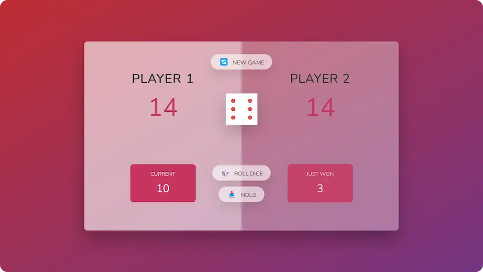

# 🎲 Pig Game

**Roll the dice and play against another player.**

## 💻 Screenshot

## 🛠️ Tools and technologies
`JavaScript` `HTML` `CSS` `VS Code`

## 🌐 Deployment
Deployed on `Netlify`.

Live preview at [dawidlehai-pig-game.netlify.app](https://dawidlehai-pig-game.netlify.app/).

## ℹ️ Instructions
This is a game for 2 players. The first player starts by rolling the dice. If the number on the dice is greater than 1, it is added to the current score. The player then has two options: 1) roll again, or 2) hold to the points and let the second player make its turn. Rolling again may earn additional points but it's also risky because if the number on the dice is 1, then you lose all additional points. The first one who gets 100 points, wins!

## 🎓 Related course
This project was created as a part of the [Udemy](https://www.udemy.com/ 'Udemy') course [_The Complete JavaScript Course 2022: From Zero to Expert!_](https://www.udemy.com/course/the-complete-javascript-course/ 'See this course on Udemy') by [Jonas Schmedtmann](https://twitter.com/jonasschmedtman 'Jonas Schmedtmann on Twitter').
